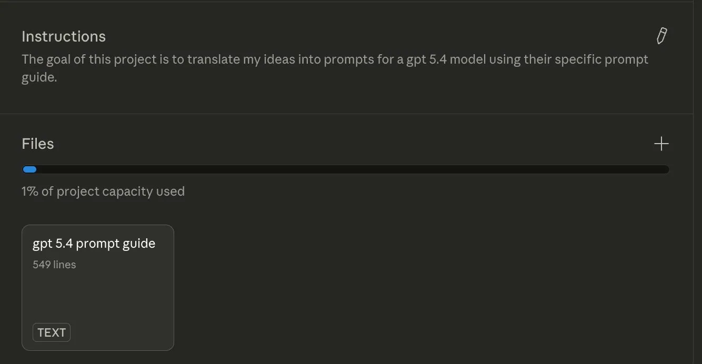
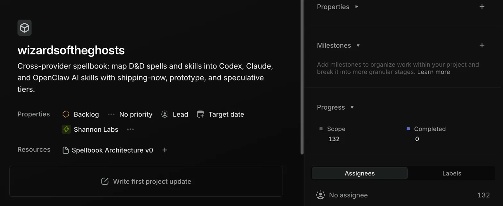
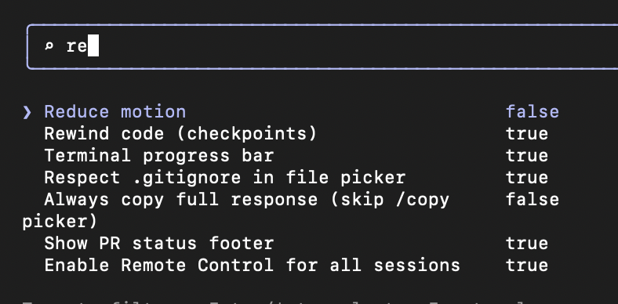
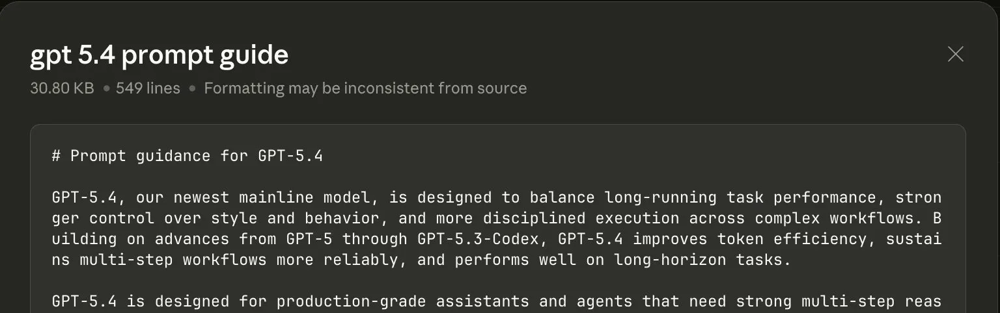

# Call Me Trimtab

The interesting thing about AI right now is not "AI can code."

The interesting thing is that one person can now run a disciplined, self-verifying project loop: break the work into a dependency graph, let an orchestrating agent execute the next unblocked task, force a separate verifier to return `PASS`, `FAIL`, or `INSUFFICIENT`, and refuse to move forward until the check passes.

That is a real operating model, not a demo trick.

## The Setup

I got to this through Buckminster Fuller.

I was listening to *Critical Path* and thinking about Apollo: a huge program reduced to a chain of dependent steps, each with criteria for done, none skippable just because the destination was exciting.

That maps surprisingly well onto modern agent workflows.

To stress-test the idea, I picked a ridiculous project: "parallel universe access." Not because I think it is feasible. Because I do not. I wanted a test case that would force the system to stay honest.

I used a Claude project loaded with the GPT-5.4 prompt guide to turn the idea into a decomposition prompt for GPT-5.4 Pro.


*A Claude project with one job: improve the decomposition prompt.*

GPT-5.4 Pro turned that into a large markdown dependency graph: roughly 200 steps, seven phases, and later sections explicitly labeled with things like "NO CURRENT APPROACH" where the path stopped being real.

Then I had Claude load the graph into Linear as issues with dependencies and milestones, and pointed Claude Code at Step 1.


*The plan becomes operational once the dependency graph is live in Linear.*

At the time I am writing this, it is on Step 6.

## The Loop

1. Break the project into a strict dependency graph.
2. Give every step a deliverable and pass/fail criteria.
3. Let one agent execute the next unblocked task.
4. Dispatch separate sub-agents for scoped research, drafting, implementation, or review.
5. Send the finished work to an independent verifier.
6. Do not move forward until the verdict is `PASS`.

The important detail is that the worker and the checker are not the same context.

That separation is what makes the loop self-correcting instead of self-congratulatory.

## Why This Stack Works

### Codex via MCP

The [Codex MCP server](https://developers.openai.com/codex/mcp/) makes sub-agent dispatch practical. The orchestrator can start a scoped task in a fresh Codex thread, come back later, and continue the same thread without stuffing all of that history into its own context.

### Claude Code as Orchestrator

Claude Code can coordinate Codex work, run its own sub-agents, and synthesize across multiple results. Its real job is not typing. Its real job is keeping the board straight.

### Linear as the Graph

Linear holds the dependency graph, the blocking relationships, and the audit trail. Agents can read and update the same state through the [Linear MCP server](https://linear.app/docs/mcp), and the project remains visible from anywhere.

### Remote Control

[Claude Code Remote Control](https://code.claude.com/docs/en/remote-control) lets the system stay alive while you step away from your desk. That turns the human role into steering rather than constant supervision.


*If you are using Claude Code Desktop, turn this on early.*

In practice, I have found "enable for all sessions" to be the safer path for long-running setups because the desktop MCP timeout behavior seems different enough that I do not want it in the middle of the loop.

## The Highest-Leverage Part

The highest-leverage part is decomposition.

If the graph is vague, everything downstream gets vague. If the graph is sharp, the whole system gets better.

That is why I use the [GPT-5.4 prompt guide](https://developers.openai.com/api/docs/guides/prompt-guidance/) as project memory when I am forming the decomposition prompt.


*Better decomposition prompts produce better graphs, which produce better downstream work.*

The prompt template is simple:

```text
Break [your project] into a strict dependency graph. For each step:
1. What it produces (the deliverable)
2. What it depends on (which prior steps must be done)
3. Pass/fail criteria (how to objectively verify it's done)

Be rigorous. If a step is vague, break it into sub-steps until the
criteria are testable. No step should require work from a later step.
```

You are not trying to get a beautiful paragraph out of the model. You are trying to get a graph another agent can execute without inventing what "done" means.

## What Generalizes

The weird parallel-universe project is not the point. The method generalizes to software, design systems, research notes, math, game design, and other work that benefits from explicit dependencies and independent verification.

You also do not need the same provider for both roles. One model can work. Another can verify. What matters is separation between worker and checker.

## What I Packaged

I packaged the current best setup into Trimtab, a starter repo that scaffolds the working parts into a target workspace: `CLAUDE.md`, `AGENTS.md`, a dependency graph, a handoff file, a deliverables directory, and GitHub templates that require verification evidence.

```bash
node scripts/bootstrap-workspace.mjs /path/to/your-project
```

## Why "Trimtab"

A trimtab is the small flap on a ship's rudder. You move the trimtab, the water moves the rudder, and the rudder turns the ship.

Buckminster Fuller put "Call me Trimtab" on his gravestone.


*The name was not hard to choose.*

The hard part was never intelligence. It was coordination.
